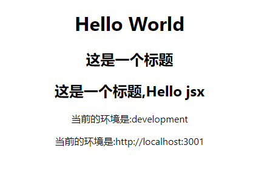

## React 框架理论知识

1. React 是 mvc 体系，vue 是 mvvm 体系
   - mvc: model(数据)-view(视图)-controller(控制器)
     > 1. 我们需要按照专业的语法去构建 app 页面，react 使用的是 jsx 语法
     > 2. 构建数据层，需要动态处理的的数据都要数据层支持
     > 3. 控制层: 当我们需要在视图中进行数据更新时，需要控制层去修改相关数据，然后 react 框架会根据数据的变化去更新视图
     >    `数据驱动视图的渲染` => `单向驱动`
     >    视图中的表单内容改变，想要修改数据，需要开发者自己去写事件监听函数，然后修改数据
   - mvvm: model(数据)-view(视图)-viewModel(视图模型监听层)
     > 1. 数据驱动视图渲染：监听数据的更新，当数据更新时，视图自动渲染
     > 2. 视图驱动数据的更新: 监听页面中表单元素的内容改变，自动去修改数据
     >    `双向驱动`

## jsx 语法

- jsx: javascript xml,就是把 html 和 javascript 结合起来写

```jsx
function App() {
  useEffect(() => {
    console.log(process.env);
    // 请求接口
    fetch("/api/v1/users")
      .then((res) => res.json())
      .then((res) => console.log(res));
  }, []);

  /**
   * 直接显示的静态组件
   */
  const oBox = <h2>这是一个标题</h2>;
  /**
   * 需要传参的组件
   */
  const oBox2 = function (title) {
    return <h2>这是一个标题,{title}</h2>;
  };
  return (
    <div className="App">
      <h1>Hello World</h1>
      {oBox}
      {oBox2("Hello jsx")}
      <p>当前的环境是:{process.env.NODE_ENV}</p>
      <p>当前的环境是:{process.env.REACT_APP_API_URL}</p>
    </div>
  );
}
```



`{}`支持 js 表达式，包括函数调用，变量引用，三目运算，逻辑运算等
不包括语句，如 `if`、`for`,`while` 等

- `ReactDOM.createRoot(document.getElementById("root")).render(<App />)`不能把 body,html 作为根节点渲染，需要我们自己创建 div 作为根节点
- 组件名必须大写，否则会报错
- 一个组件中只能有一个根节点，如果有多个根节点，需要使用 `fragment` 包裹，或者使用 `div` 包裹，`<></>`也是 `fragment` 的语法糖

## jsx 底层渲染机制

1. 把我们编写的 jsx 代码编译成 virutal dom 对象【virtualDom】
