## react 中的合成事件与浏览器中的原生事件

React 通过将事件 normalize 以让他们在不同浏览器中拥有一致的属性。

- 合成事件

  > SyntheticEvent 实例将被传递给你的事件处理函数，它是浏览器的原生事件的跨浏览器包装器。除兼容所有浏览器外，它还拥有和浏览器原生事件相同的接口，包括 stopPropagation() 和 preventDefault()。

  > 如果因为某些原因，当你需要使用浏览器的底层事件时，只需要使用 nativeEvent 属性来获取即可。合成事件与浏览器的原生事件不同，也不会直接映射到原生事件。例如，在 onMouseLeave 事件中 event.nativeEvent 将指向 mouseout 事件。每个 SyntheticEvent 对象都包含以下属性：

  ```js
  boolean bubbles
  boolean cancelable
  DOMEventTarget currentTarget
  boolean defaultPrevented
  number eventPhase
  boolean isTrusted
  DOMEvent nativeEvent
  void preventDefault()
  boolean isDefaultPrevented()
  void stopPropagation()
  boolean isPropagationStopped()
  void persist()
  DOMEventTarget target
  number timeStamp
  string type
  ```

```js
import { Component } from "react";
class ClassComp extends Component {
  state = {
    count: 10,
  };
  handleAdd = (e) => {
    this.setState({ count: this.state.count + 1 });
    console.log(e);
  };
  render() {
    const { count } = this.state;
    return (
      <div>
        Class Component
        <p>
          {count}
          <br />
          <button onClick={this.handleAdd}>add</button>
        </p>
      </div>
    );
  }
}
export default ClassComp;
```

`SyntheticBaseEvent`是对浏览器原生事件的一个封装，让不同的浏览器的 API 表现一致。浏览器常用的事件基本都有

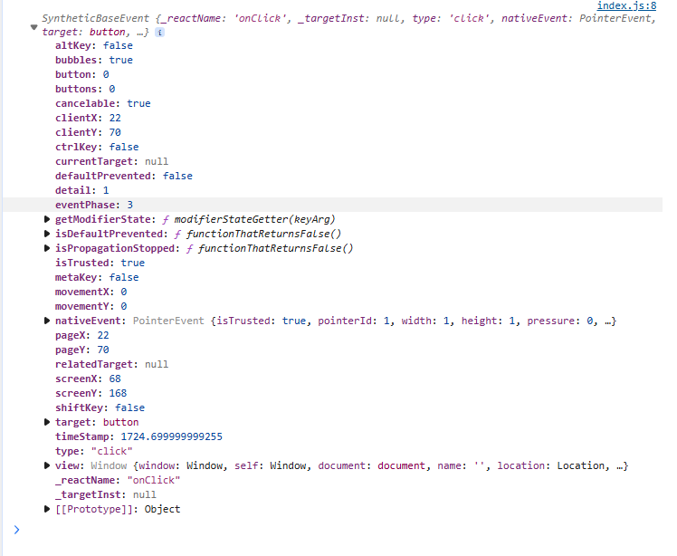

- 原生事件

```html
<body>
  <noscript>You need to enable JavaScript to run this app.</noscript>
  <div id="root"></div>
  <div id="box">
    <button id="btn">提交</button>
  </div>
  <script>
    window.onload = function () {
      const btn = document.getElementById("btn");
      btn.onclick = handleClick;
    };

    function handleClick(e) {
      console.log("🚀 ~ handleClick ~ e:", e);
      console.log("提交成功");
    }
  </script>
</body>
```

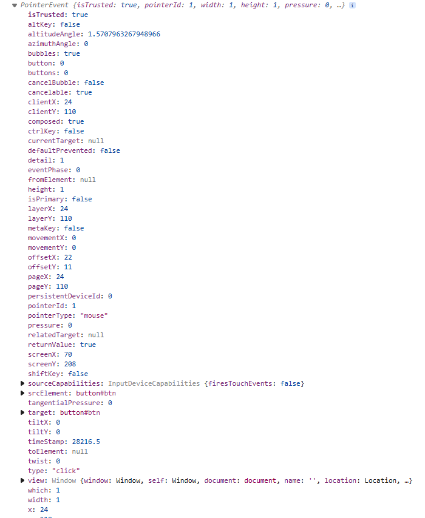

- 是要方法经过 bind 处理，那么最后一个实参就是传递的合成事件对象。

```js
handleAdd = (x, e) => {
  console.log("🚀 ~ ClassComp ~ x:", x);
  console.log(e);
};
<button onClick={this.handleAdd.bind(null, 20)}>add</button>;
```

- 直接使用箭头函数，获取事件对象和参数

```js
handleAdd2 = (e, x) => {
  console.log("🚀 ~ ClassComp ~ e, x:", e, x);
};
<button onClick={(e) => this.handleAdd2("10", e)}>add2</button>;
```

## 事件委托

利用事件的传播机制，将事件绑定到父元素上，通过判断目标元素来执行相应的事件。
传统方法是直接获取元素，然后绑定事件。

- 事件的捕获和冒泡

  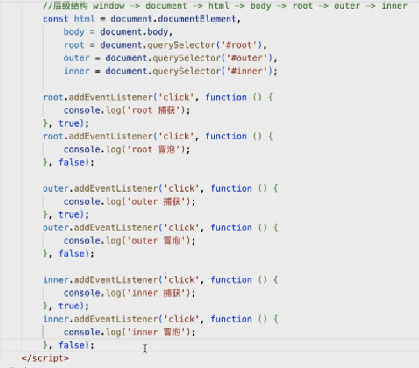
  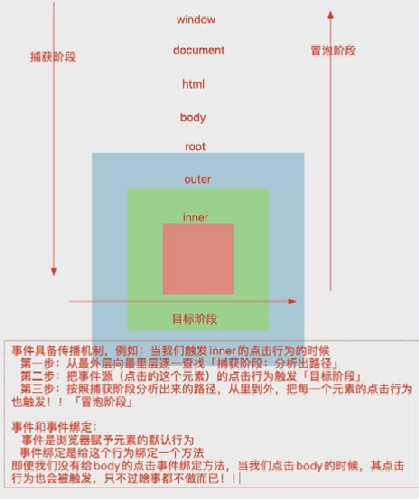
  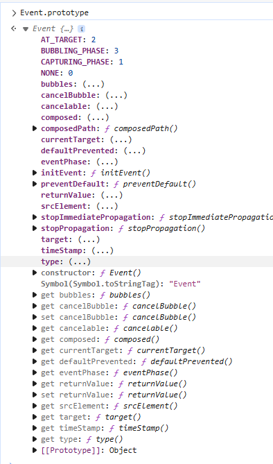

- 目标元素组织冒泡

- event.stopPropagation()在事件对象中，调用该方法将阻止事件（包括冒泡或捕获）在 DOM 中继续传播。
- event.stopImmediatePropagation()在事件对象中，调用该方法其他未执行的方法也不会执行了
  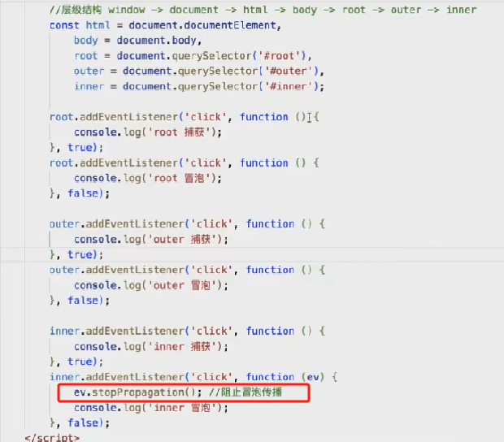
  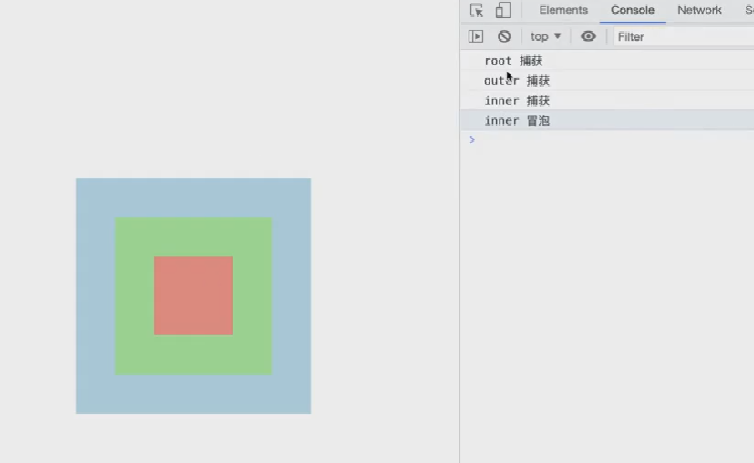

- 最外层阻止冒泡，阻止事件继续向上传播

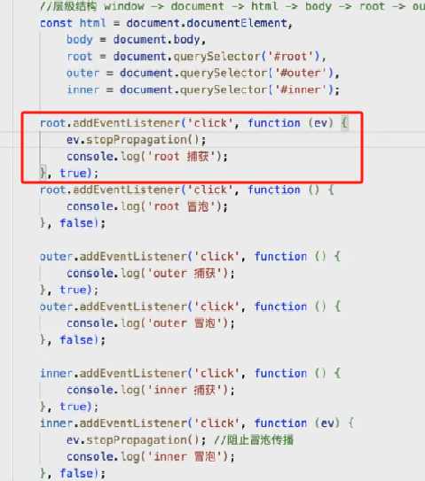
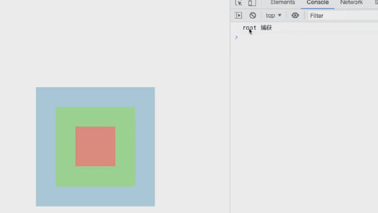

## React 中合成事件的原理

- 合成事件绝对不是直接给元素`addEventListener`进行事件的绑定，而是通过事件委托的方式，给 document 进行事件的绑定。
- r17 之前的 React 内部通过事件池`SyntheticEvent`来统一处理浏览器兼容问题，并且将事件委托给 document，且只做了对冒泡阶段的委托。
- 事件池`SyntheticEvent`是一个对象，用来包装原生事件。
- r17 及以后版本，事件池`SyntheticEvent`是单例模式。都是委托给#root 这个容器，捕获和冒泡都做了委托
- 事件池`SyntheticEvent`对象在事件池中缓存，当事件触发时，会从事件池中获取一个对象。
- 对于没有事件传播机制的事件，才是单独做的事件绑定。例如,onMouseEnter,onMouseLeave,onFocus 等。
- 在组件渲染的时候，如果发现有 onXxx,onXxxxCapture 这样的属性，不会直接给元素绑定事件，只是把该方法作为属性保存到组件的实例上。然后对#root 容易做了事件绑定。
  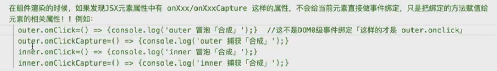

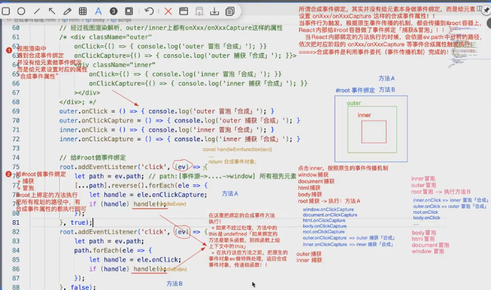

- 合成事件中的阻止冒泡，既阻止了原生事件，也阻止了合成事件的冒泡。
- 如果只阻止原生事件的冒泡，`ev.naiveEvent.stopPropagation()`

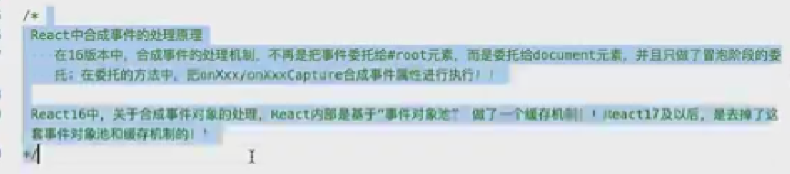
