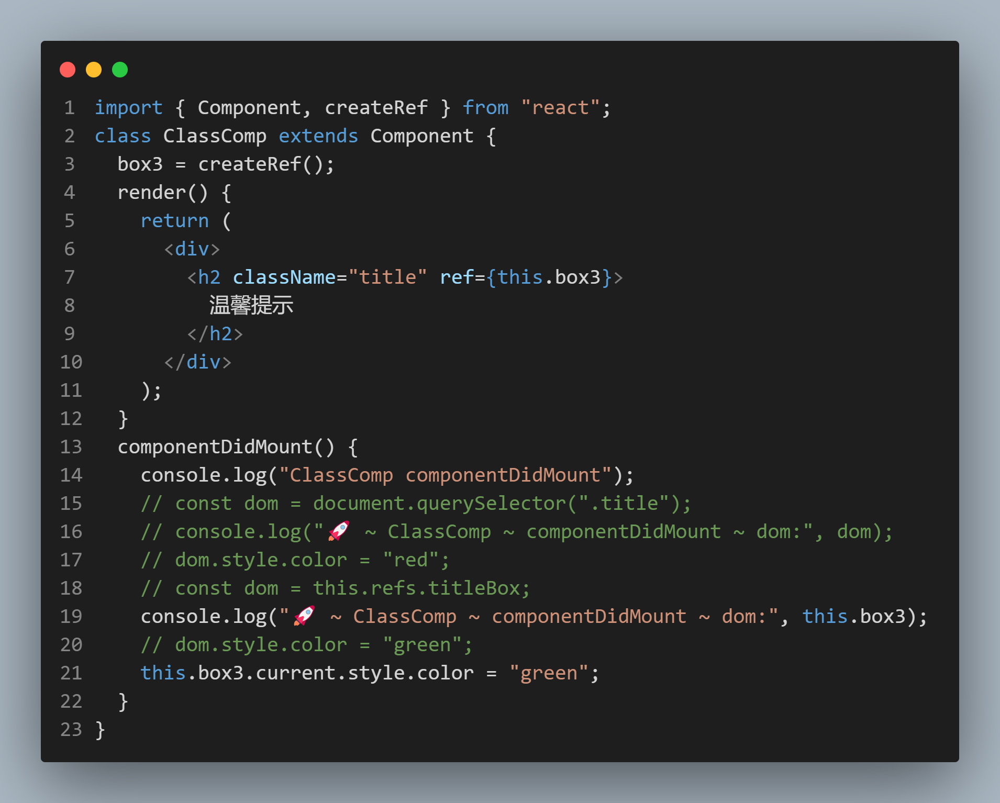
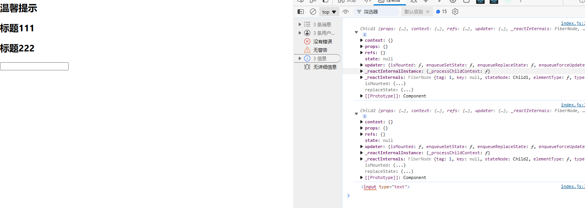
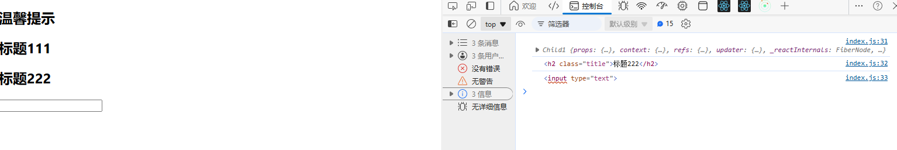

## setState 的深层分析

### 受控与非受控组件

- 受控组件,基于修改 state 的值,修改组件内部的状态，来实现页面的更新，推荐使用
- 非受控组件，基于 ref 获取 dom 的值，来实现页面的更新,不推荐使用,偶尔特殊的场景会使用

  - 给需要获取的元素设置 ref=“xxx”,后期基于 this.refs.xxx 去获取相应的 dom 元素(不推荐使用)

  ```html
  <div>
    <h2 className="title" ref="box2">温馨提示</h2>
  </div>
  ```

  获取:`this.refs.box2`

  - 把 ref 设置为函数的方式,推荐使用

  ```html
  <div>
        <h2 className="title" ref={(x) => (this.box2 = x)}>
          温馨提示
        </h2>
      </div>
  ```

  获取:`this.box2.style.color = "green";`

  - 基于 createRef 创建的 ref,推荐使用
    

```js
componentDidMount() {
    console.log("ClassComp componentDidMount");
    // const dom = document.querySelector(".title");
    // console.log("🚀 ~ ClassComp ~ componentDidMount ~ dom:", dom);
    // dom.style.color = "red";
    // const dom = this.refs.titleBox;
    console.log("🚀 ~ ClassComp ~ componentDidMount ~ dom:", this.box2);
    // dom.style.color = "green";
    this.box2.style.color = "green";
  }
```

> 原理：render 函数执行的时候，获取 vdom 的 ref 属性，然后根据 ref 的值去 dom 树中找对应的节点

- 如果是字符串，则会给 this.refs 增加一个这样的成员，成员值就是当前的 dom 节点
- 如果是函数，则直接调用这个函数，并将当前 dom 节点作为参数传递进去,我们一般都是直接把这个 dom 挂在到实例的某个属性上

## 组件和 dom 元素上的 ref

- 组件上：ref={(x) => (this.box2 = x)} 获取的是组件实例
- 元素上：ref="box2" 获取的是 dom 节点

```js
import { Component, createRef } from "react";

class Child1 extends Component {
  render() {
    return <h2 className="title">标题111</h2>;
  }
}
class Child2 extends Component {
  render() {
    return <h2 className="title">标题222</h2>;
  }
}

class ClassComp extends Component {
  box3 = createRef();
  render() {
    return (
      <div>
        <h2 className="title" ref={this.box3}>
          温馨提示
        </h2>
        <Child1 ref={(x) => (this.child1 = x)} />
        <Child2 ref={(x) => (this.child2 = x)} />
        <input type="text" ref={(x) => (this.input = x)} />
      </div>
    );
  }
  componentDidMount() {
    console.log(this.child1);
    console.log(this.child2);
    console.log(this.input);
  }
}
export default ClassComp;
```



- 在函数组件上使用函数的方式获取 `ref`,会报错，正确的方式是使用 `forwardRef` 来实现 `ref` 的转发，获取函数子组件的 `dom` 节点

```js
import { Component, createRef, forwardRef } from "react";

class Child1 extends Component {
  render() {
    return <h2 className="title">标题111</h2>;
  }
}
const Child2 = forwardRef(function (props, ref) {
  return (
    <h2 className="title" ref={ref}>
      标题222
    </h2>
  );
});

class ClassComp extends Component {
  box3 = createRef();
  render() {
    return (
      <div>
        <h2 className="title" ref={this.box3}>
          温馨提示
        </h2>
        <Child1 ref={(x) => (this.child1 = x)} />
        <Child2 ref={(x) => (this.child2 = x)} />
        <input type="text" ref={(x) => (this.input = x)} />
      </div>
    );
  }
  componentDidMount() {
    console.log(this.child1);
    console.log(this.child2);
    console.log(this.input);
  }
}
export default ClassComp;
```


