## setState 分析

setState 是 react 中更新 UI 的唯一方法，其内部实现原理如下：

1. 调用 setState 函数时，React 将传入的参数对象加入到组件的更新队列中。
2. React 会调度一次更新（reconciliation），在调度过程中，React 会根据组件的 state 和 props 来计算出组件的新的状态，并比较新旧的状态，决定是否需要重新渲染组件。

`this.setState([particalState], [callback])`中

- `particalState` 是一个对象，支持部分修改 `state`,只更新当前要修改的属性，其余的保持不变。
- `callback` 是可选的函数，在 setState 更新完成之后执行。类似于 `vue` 中的 `nextTick` 机制。
  - 发生在 `componetDidUpdate` 生命周期之后，DOM 更新完成之后。
  - componetDidUpdate 会在任何 state 更新之后调用，不管是否是 setState 引起的。
  - 这里的回调函数，只会在特定的 state 变化后出发，还要主动调用。
  - 即使我们使用了 `shouldComponentUpdate`返回 false 来组织组件更新， `componentDidUpdate` 不更新了，回调函数依然会执行。

```js
import { Component } from "react";

class ClassComp extends Component {
  state = {
    x: 10,
    y: 20,
    z: 0,
  };
  handleAdd = () => {
    // this是指向当前组件的实例，箭头函数式没有自己的this
    this.setState(
      {
        x: this.state.x + 1,
      },
      () => {
        console.log(this.state.x, "xxxxxxxxxxxxx");
      }
    );
  };
  shouldComponentUpdate() {
    return false;
  }
  componentDidUpdate() {
    console.log("componentDidUpdate class component");
  }
  render() {
    console.log("render class component");
    const { x, y, z } = this.state;
    return (
      <div>
        Class Component
        <p>
          x: {x}, y: {y} z:{z}
          <br />
          <button onClick={this.handleAdd}>add</button>
        </p>
      </div>
    );
  }
}
export default ClassComp;
```

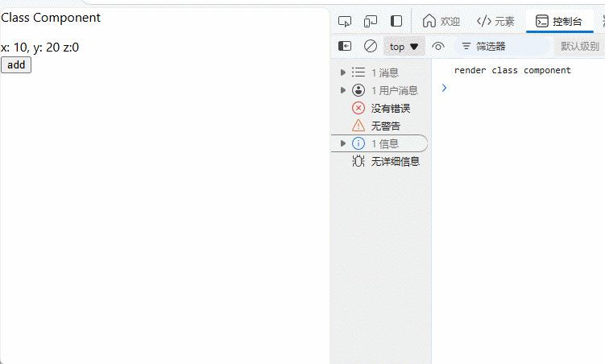

## setState 的同步与异步

- r18 中，setState 在任何地方都是异步的,包括合成事件，周期函数，定时器。。。

  - r18 中有一套更新队列的机制,[updater]来处理的
  - 基于异步操作实现状态的批处理

- 好处：
  - 异步的目的是为了性能优化，在多个 setState 调用时，可以合并成一个 state 更新
  - 异步的目的是为了防止 setState 调用过于频繁，造成性能问题
    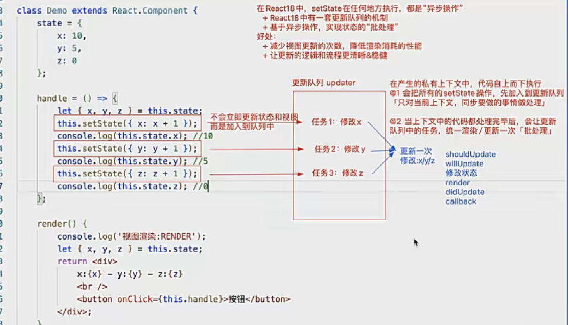
    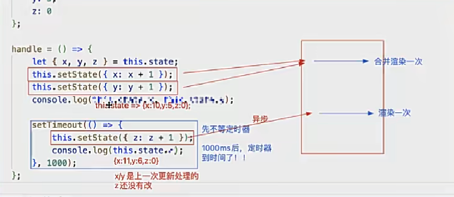
    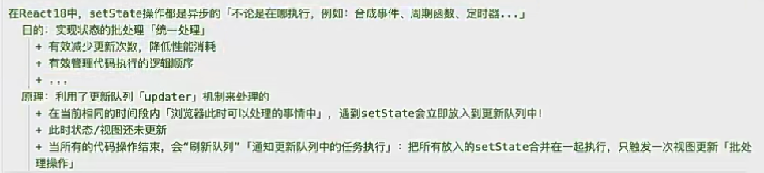
- 在 r18 之前。我们只在 `react` 的合成事件和生命周期函数中调用 setState 做批量更新，默认情况下，不会对原生事件,`promise`,`setTimeout`,`requestAnimationFrame` 等异步操作做批量更新。

r16 中的执行效果
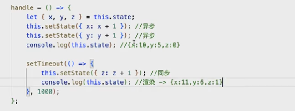
r18 中的执行效果
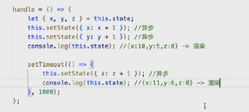

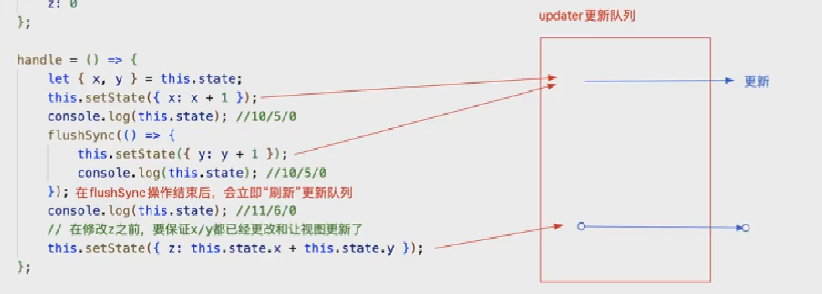

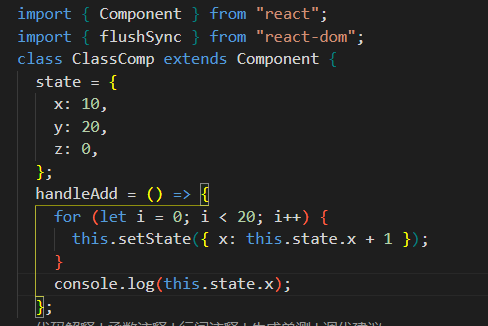
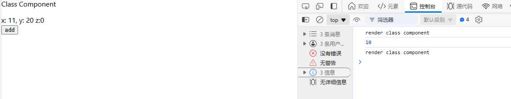
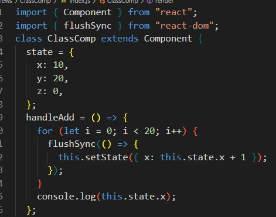
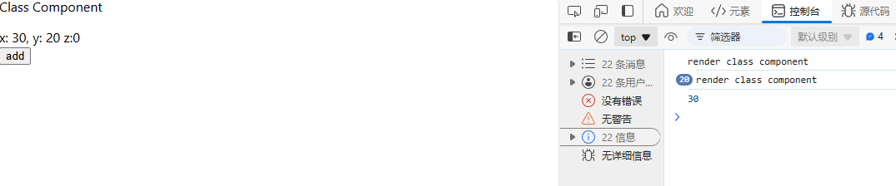

## 需求

点击一个按钮，让数字 x 加一，结果为 30

```js
import { Component } from "react";
class ClassComp extends Component {
  state = {
    x: 10,
    y: 20,
    z: 0,
  };
  handleAdd = () => {
    for (let i = 0; i < 20; i++) {
      this.setState(x:this.state.x+1);
    }
    console.log(this.state.x);
  };
  render() {
    console.log("render class component");
    const { x, y, z } = this.state;
    return (
      <div>
        Class Component
        <p>
          x: {x}, y: {y} z:{z}
          <br />
          <button onClick={this.handleAdd}>add</button>
        </p>
      </div>
    );
  }
}
export default ClassComp;
```

可以发现，打印结果为 1, 不是 30,改造代码，引入 `flushSync`
写法 1：

```js
import { Component } from "react";
import { flushSync } from "react-dom";

  handleAdd = () => {
    for (let i = 0; i < 20; i++) {
      flushSync(() => {
        this.setState(x:this.state.x+1);
      }）
    }
    console.log(this.state.x);
  };

export default ClassComp;
```

写法 2：

```js
import { Component } from "react";
import { flushSync } from "react-dom";

  handleAdd = () => {
    for (let i = 0; i < 20; i++) {
       this.setState(x:this.state.x+1);
       flushSync()
    }
    console.log(this.state.x);
  };

export default ClassComp;
```

可以看到 render 执行了 20 次，但是打印结果为 30,如果只让 render 执行一次，打印结果为 30,需要改造代码

```js
import { Component } from "react";
class ClassComp extends Component {
  state = {
    x: 10,
    y: 20,
    z: 0,
  };
  handleAdd = () => {
    for (let i = 0; i < 20; i++) {
      this.setState((prev) => {
        return { x: prev.x + 1 };
      });
    }
    console.log(this.state.x);
  };
  render() {
    console.log("render class component");
    const { x, y, z } = this.state;
    return (
      <div>
        Class Component
        <p>
          x: {x}, y: {y} z:{z}
          <br />
          <button onClick={this.handleAdd}>add</button>
        </p>
      </div>
    );
  }
}
export default ClassComp;
```

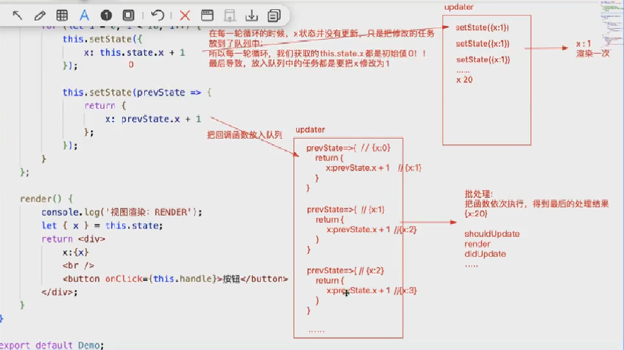
