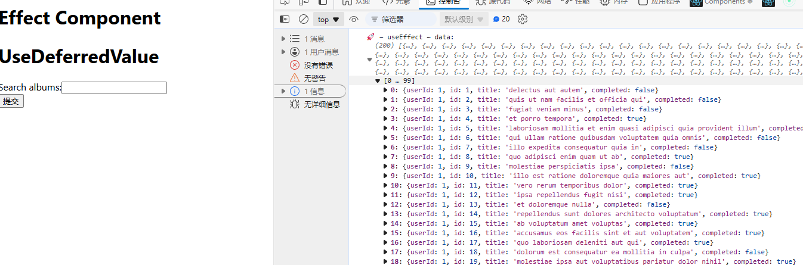

## useEffect 的使用

useEffect 是 React 中用于处理副作用的函数。它可以在组件渲染后执行一些额外的操作，例如发送网络请求、更新 DOM 等。

useEffect 的基本语法如下：

```js
useEffect(() => {
  // 副作用代码
}, [依赖项]);
```

其中，第一个参数是一个回调函数，会在组件渲染后执行；第二个参数是一个数组，表示该副作用函数所依赖的变量或状态。如果第二个参数为空数组，则该副作用函数只会在组件第一次渲染时执行一次。如果第二个参数包含某个变量或状态，则该副作用函数会在该变量或状态发生变化时重新执行。

不带依赖项的 useEffect 示例：

- 只要组件渲染时执行一次

```js
useEffect(() => {
  // 副作用代码
});
```

useEffect 依赖项为空数组的示例：

- 初始化时执行一次

```js
useEffect(() => {
  // 副作用代码
}, []);
```

useEffect 依赖项有值时的示例：

- a, b, c, d 任意一个值变化时执行

```js
useEffect(() => {
  // 副作用代码
}, [a, b, c, d]);
```

在`useEffect`中，我们可以使用`async/await`语法来处理异步操作。例如：

```js
useEffect(async () => {
  const result = await fetch("xxxxxxxxxxxxxxxxxxxxxxxxxxxx");
  const data = await result.json();
  console.log("🚀 ~ useEffect ~ data:", data);
  return () => {}; // 返回一个清理函数,否则就会报错
}, []);
```

因为`useEffect`要返回的函数是清理函数,当我们在 callback 前面加上 async,返回了一个 promise,这个时候就需要返回一个清理函数,否则会报错。

或者可以这样写

```js
const getData = async () => {
  const result = await fetch("xxxxxxxxxxxxxxxxxxxxxxxxxxxxxxxxx");
  const data = await result.json();
  console.log("🚀 ~ useEffect ~ data:", data);
  return data;
};
getData();
```



清除函数的副作用,比如在组件卸载时清除定时器,且在里面函数里面获取的状态是上次更新的状态，不是当前最新的值，所以需要使用 useRef 保存状态

```js
useEffect(async () => {
  const [count, setCount] = useState(0);
  return () => {
    console.log(count)
}, []);
```

useEffect 的原理
函数组件在渲染（或更新）期间，遇到 useEffect 操作，会基于 MountEffect 方法把 callback（和依赖项）加入到 effect 链表中！

在视图渲染完毕后，基于 UpdateEffect 方法，通知链表中的方法执行！
1、按照顺序执行期间，首先会检测依赖项的值是否有更新「有容器专门记录上一次依赖项的值」；有更新则把对应的 callback 执行，没有则继续处理下一项！！
2、遇到依赖项是空数组的，则只在第一次渲染完毕时，执行相应的 callback
3、遇到没有设置依赖项的，则每一次渲染完毕时都执行相应的 callback

useLayoutEffect 的原理
其函数签名与 useEffect 相同，但它会在所有的 DOM 变更之后同步调用 effect。
可以使用它来读取 DOM 布局并同步触发重渲染。
在浏览器执行绘制之前，useLayoutEffect 内部的更新计划将被同步刷新。
尽可能使用标准的 useEffect 以避免阻塞视觉更新。
