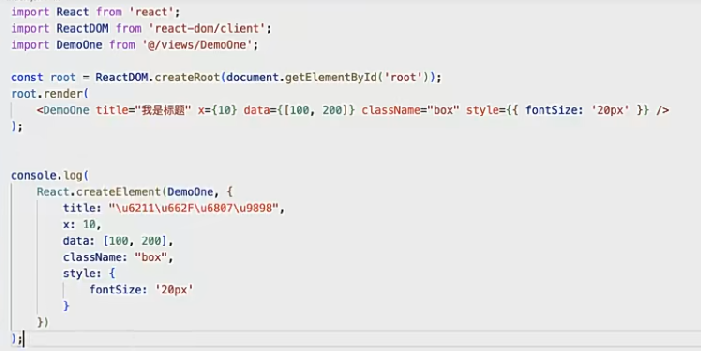
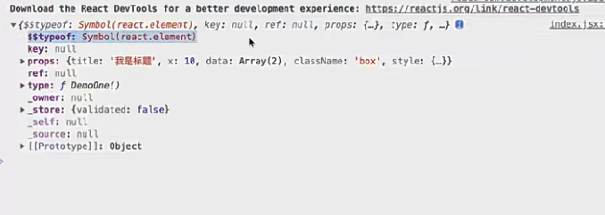
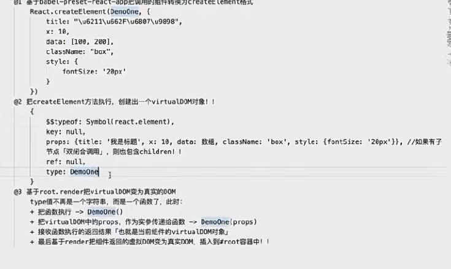
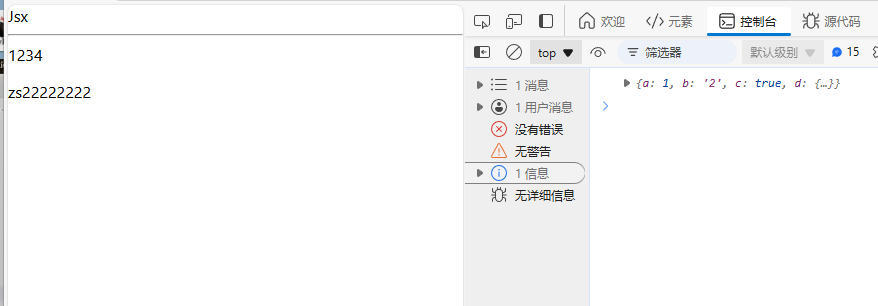
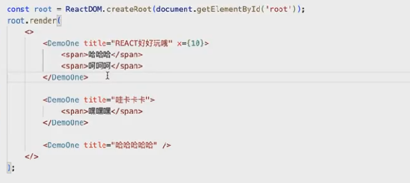
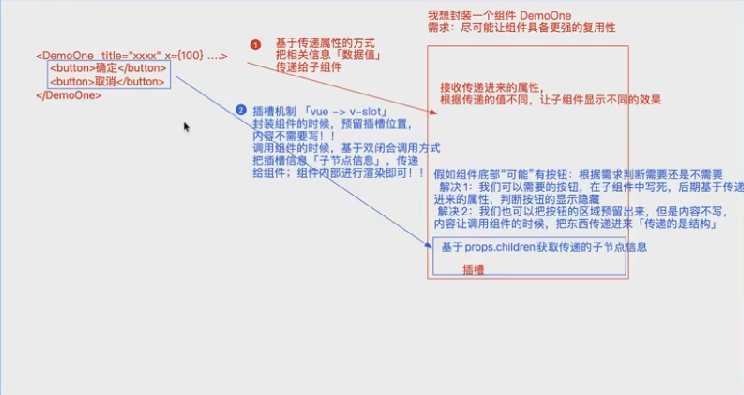
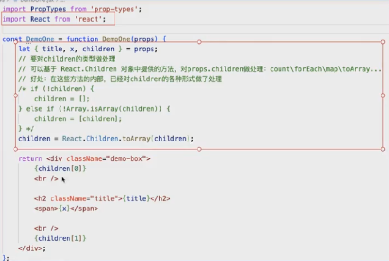
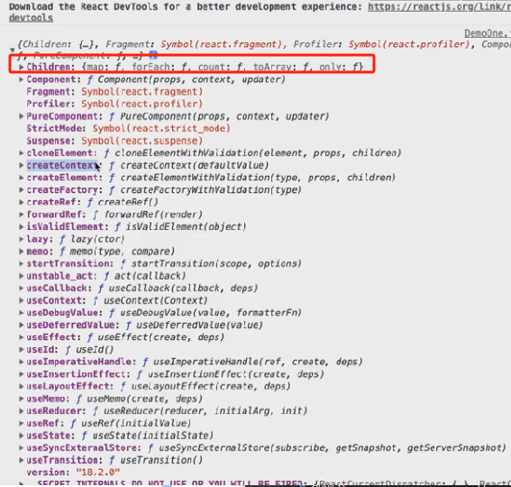
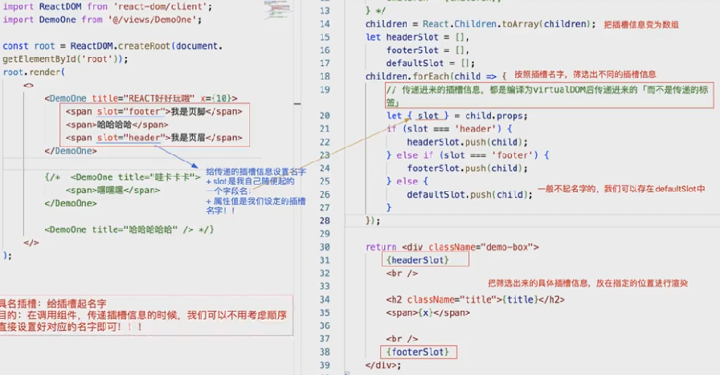
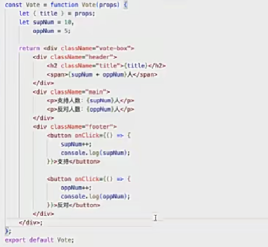

## react 中的函数组件底层渲染原理

- `react`组件没有局部与全局之分，它是一个整体。这点跟`vue`的组件化是不同的。
- 要实现 react 中的全局组件，可以将组件挂在`react`上，这样只要引入了`react`，就可以直接使用该组件。

## 函数式组件的创建

- 创建一个函数，函数中返回一个`jsx`或者`jsx`元素，`virtualdom`。
- 基于 es6 的模块导入导出方式，将函数作为模块的导出.可以忽略后缀名。

```js
<Component />
<Component>...</Component>
```

- 命名：首字母大写，大驼峰命名。小写字母开头，编译器会认为这是一个标签，编译器也会报错。
  
  
  

## 关于 props 属性的细节知识

- 函数组件不能使用`this`关键字。
- 函数组件不能使用生命周期钩子。
- 子组件的`props`属性，不能直接修改。
- 获取子组件的`props`属性，需要使用`props.xxx`。

### 对象的`冻结`，`密封`和`不可扩展`

- 被冻结的对象，不能添加、删除或修改其属性。也不能劫持对象。`Object.defineProperty`方法不能修改这些属性。`Object.isFrozen`方法用来检测对象是否被冻结。
- 被密封的对象的属性，可以修改值，但是不能添加、删除。但不能劫持对象。`Object.isSealed`方法用来检测对象是否被密封。
- 不可扩展的对象，除了不能新增成员，其他操作都正常。`Object.isExtensible`方法用来检测对象是否可以扩展。

总结: 被冻结的对象，既是不可扩展的，也是密封的。被密封的，也是不可扩展的。

所以，我们在组件内部修改`props`属性时，需要先拷贝一份，然后才能修改。否则会报错。

## 组件的默认值

- 函数组件.`defaultProps`属性，可以设置组件的默认值。

```js
function Jsx({ name }) {
  return (
    <div>
      Jsx
      <hr />
      <p>{name}</p>
    </div>
  );
}

Jsx.defaultProps = { name: "zs22222222" };
export default Jsx;
```



## 函数的类型校验

- 函数组件.`propTypes`属性，可以设置组件的默认值。 需要我们安装`prop-types`库。
  跟`Component`组件一样，需要使用`import`导入。

```js
import PropTypes from "prop-types";
Child.defaultProps = { name: "zs22222222", age: 18 };
Child.propTypes = {
  name: PropTypes.string,
  age: PropTypes.oneOfType([
    PropTypes.number.isRequired,
    PropTypes.string,
    PropTypes.bool,
  ]),
};
```

## 函数组件中的插槽处理

- 插槽的作用，就是将父组件中的内容，原封不动的传递给子组件。想办法让组件更加灵活，具有更强的复用性

  - 数据值用属性
  - html 片段用插槽
    
    
  - children 属性，传递子组件的`jsx`元素,是数组的情况下，要使用下面的方式来接收，也可以使用`React.Children`里面的方法来进行处理
    
    

  - 插槽内容可以根据不同的需求，放到不同的位置。
    

## 静态组件和动态组件

- 第一次渲染组件，执行函数，产生一个私有的上下文，把解析出来的 `props` 包括 `children` 属性，保存到上下文,并冻结了`props`属性，不可修改。返回一个`jsx`元素的`vdom`。渲染`jsx`元素，生成`virtualdom`。
- 当我们点击按钮，再次渲染组件时
  修改上下文中的变量，私有作用于发生了变化，但是视图不会更新。所以称为静态组件。
  除非在父组件中，修改了子组件的`props`属性，才会重新渲染。
  
- 动态组件:实际项目中，我们会遇到在第一次渲染组件完成后，需要基于组件内部的状态变化，让组件可以更新，以呈现出不同的页面效果。 ====> 动态组件(`class` 组件，`hooks` 组件)
