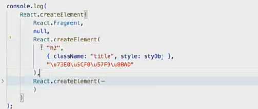
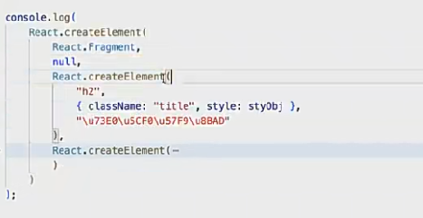
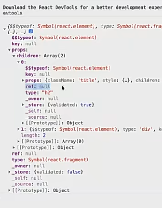
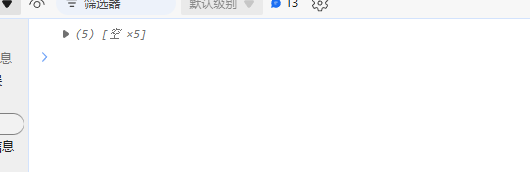
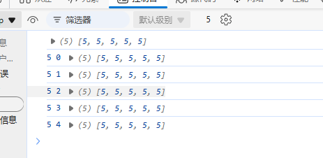

## jsx 底层渲染机制

1. 渲染 jsx 时，会先解析 jsx，生成一个虚拟 dom(virtual dom)。
2. 然后将虚拟 dom 渲染成真实 dom。
3. 如果 jsx 中包含事件，会将事件绑定到真实 dom 上。

虚拟 dom 对象，是框架内部构建的一套对象体系，对象相关的属性方法都是 react 内部规定的，
基于这些属性描述出，我们所有构建的视图中，dom 节点相关的特征。

真实 dom，就是浏览器页面中，让用户看到的页面内容。

`- 补充说明：

基于`babel-preset-react-app`，jsx 最终会被编译成 `React.createElement` 函数调用。执行后，会生成一个虚拟 dom 对象。



- 第一次渲染页面，是直接从 vdom-dom 生成真实 dom
  



- 第二次渲染页面，是先生成虚拟 dom，然后对比 vdom 和 dom 的差异，这个过程就是 `dom-diff`,计算出补丁包`patch`,两次视图差异的部分，最后更新变化的部分。`

v16 中

```js
ReactDOM.render(<App />, document.getElementById("root"));
```

v18 中

```js
ReactDOM.createRoot(document.getElementById("root")).render(<App />);
```

## jsx 页面渲染的规律

- undefined,null,'',Symbol,BigInt 会渲染成空字符串。
- 数字，字符串正常显示。
- 数组，会渲染成字符串，且去掉了数组中多余的逗号。
- 对象，无法渲染，会报错。
- 函数对象，不支持在{}中渲染，会报错。可以作为函数组件，用<Component />渲染。

## 元素样式

- 驼峰命名法：fontSize，backgroundImage。
- `style`中需要使用`{{}}`。
- 字符串拼接：`style={{color:'red',fontSize:14+'px'}}`。
- 对象：`style={styles.div}`。

## 元素的类

- 字符串拼接：`className='div'`,不要用`class`
- 对象：`className={styles.div}`。

```js
const arr1 = new Array(5); // 创建一个长度为5的数组，并赋值undefined，是稀疏数组
console.log(arr1);
arr1.forEach((value, index, array) => {
  console.log(value, index, array);
});
```

`forEach`无法迭代稀疏数组



```js
const arr1 = new Array(5).fill(5); // 创建一个长度为5的数组，并赋值5，密集数组
console.log(arr1);
arr1.forEach((value, index, array) => {
  console.log(value, index, array);
});
```


